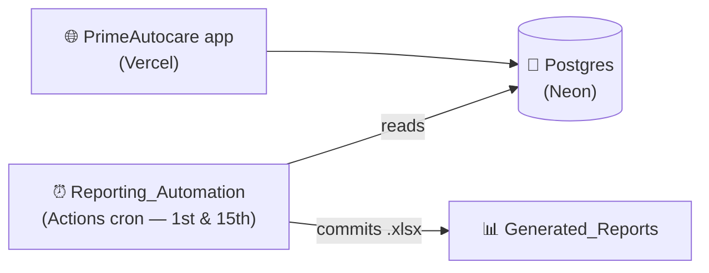

# 🚗 PrimeAutocare

### A self-sustaining simulated vehicle service management, invoicing, and automated reporting ecosystem

*Built as a portfolio project by a two-person team — deployed, scheduled, and reporting on its own.*

---

## ⚙️ How it works

The project is designed to **run itself**. The app is live on Vercel; twice a
month a GitHub Actions cron reads the database, builds five Excel business
reports, and commits them — no human in the loop.

## 📦 Repositories

| Repository | What it is |
| --- | --- |
| 🚗 [PrimeAutocare](https://github.com/PrimeAutocare/PrimeAutocare) | The application — FastAPI + SQLAlchemy backend, React 19 + Vite + Tailwind frontend, Postgres schema |
| 🤖 [Reporting_Automation](https://github.com/PrimeAutocare/Reporting_Automation) | Scheduled Groovy scripts that build five Excel reports (payroll, utilization, receivables, revenue, WIP) from the database |
| 📊 [Generated_Reports](https://github.com/PrimeAutocare/Generated_Reports) | Where those reports land — current workbook per report, with every past period archived |

Start with the [PrimeAutocare README](https://github.com/PrimeAutocare/PrimeAutocare#readme)
for the full picture.

## 👥 Team

<table>
  <tr>
    <td align="center">
      <a href="https://github.com/InukaWijerathna">
         
        <b>Inuka Wijerathna</b>
      </a>
    </td>
    <td align="center">
      <a href="https://github.com/SenukaWijerathna">
         
        <b>Senuka Wijerathna</b>
      </a>
    </td>
  </tr>
</table>
