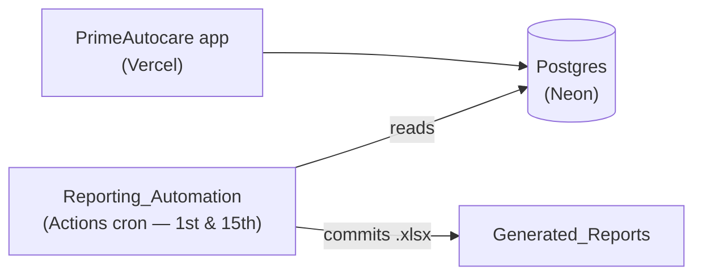

# PrimeAutocare

**A self-sustaining simulated vehicle service management, invoicing, and automated reporting ecosystem**

Built as a portfolio project by a two-person team — deployed, scheduled, and reporting on its own.

---

## Overview

PrimeAutocare is a vehicle service center management system that tracks
customers, vehicles, service visits, job assignments, invoices, and payments.
The system is designed to run without intervention: the application is deployed
on Vercel, and a scheduled pipeline reads the live database twice a month,
builds Excel business reports, and publishes them to a dedicated repository.

## Repositories

| Repository | Description |
| --- | --- |
| [PrimeAutocare](https://github.com/PrimeAutocare/PrimeAutocare) | The application — FastAPI + SQLAlchemy backend, React 19 + Vite + Tailwind frontend, Postgres schema |
| [Reporting_Automation](https://github.com/PrimeAutocare/Reporting_Automation) | Scheduled Groovy scripts that build five Excel reports — payroll, utilization, receivables, revenue, and WIP — from the database |
| [Generated_Reports](https://github.com/PrimeAutocare/Generated_Reports) | Published reports — the current workbook per report, with every past period archived |

Start with the [PrimeAutocare README](https://github.com/PrimeAutocare/PrimeAutocare#readme)
for the full picture.

## Team

<table>
  <tr>
    <td align="center">
      <a href="https://github.com/InukaWijerathna">
         
        <b>Inuka Wijerathna</b>
      </a>
    </td>
    <td align="center">
      <a href="https://github.com/SenukaWijerathna">
         
        <b>Senuka Wijerathna</b>
      </a>
    </td>
  </tr>
</table>
