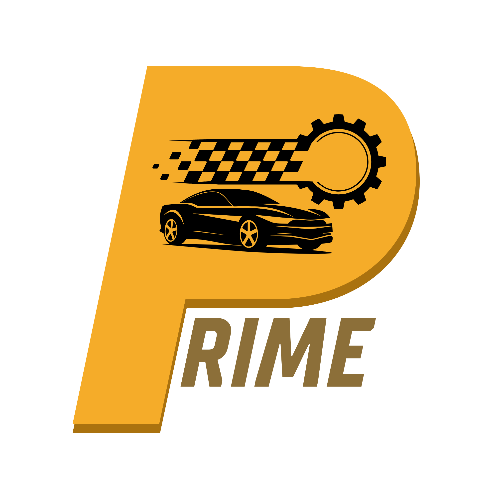
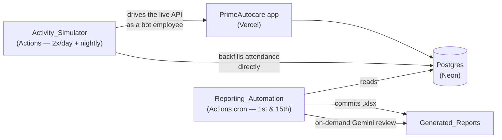

  

  # Service Management and Automated Reporting Ecosystem, Running on Simulated Activity.

**PrimeAutocare** is a vehicle service management and invoicing platform built
by a two-person team as a portfolio project — not a static demo, but a real,
running system with its own automated ecosystem around it. The core
application is a genuine full-stack CRUD system (customers, vehicles, jobs,
invoices, payments, attendance) with real authentication, authorization, and
database constraints. What's *simulated* is only the day-to-day activity
flowing through it: a scheduled bot drives the live API to generate realistic
jobs, invoices, and worklogs, so the system always has fresh data to operate
on. What's *automated* is the reporting layer: a separate pipeline reads that
data on a fixed schedule and turns it into business reports, with no person
involved at any step.

Together, that means three things are true at once, continuously, without
manual intervention: the application stays live, the data stays fresh, and
the reports stay current.

---

## 🏗️ Architecture

The diagram below traces one full cycle: the deployed app and its database at
the center, the simulator feeding it activity from one side, and the
reporting pipeline reading from it and publishing output on the other.

```mermaid
flowchart LR
    A["PrimeAutocare app<br/>(Vercel)"] --> DB[("Postgres<br/>(Neon)")]
    E["Activity_Simulator<br/>(Actions — 2x/day + nightly)"] -- "drives the live API<br/>as a bot employee" --> A
    E -- "backfills attendance<br/>directly" --> DB
    R["Reporting_Automation<br/>(Actions cron — 1st &amp; 15th)"] -- reads --> DB
    R -- "commits .xlsx" --> G["Generated_Reports"]
    R -- "on-demand Gemini review" --> G
```

**How a cycle actually runs:**

1. **The app** ([PrimeAutocare](https://github.com/PrimeAutocare/PrimeAutocare))
   serves real traffic on Vercel — a FastAPI backend, a React frontend, and a
   normalized Postgres schema enforcing the business rules.
2. **The simulator** ([Activity_Simulator](https://github.com/PrimeAutocare/Activity_Simulator))
   wakes up on its own schedule, logs in as a bot employee, and performs the
   same actions a real technician or admin would — starting jobs, completing
   them, raising invoices, recording payments — through the same API and the
   same validation everyone else goes through. A second, nightly job backfills
   realistic attendance directly in the database, since clock-in/out times
   can't be backdated through the API itself.
3. **The reporting pipeline** ([Reporting_Automation](https://github.com/PrimeAutocare/Reporting_Automation))
   runs on the 1st and 15th of every month, reads the database independently
   of the app, and builds six Excel reports covering payroll, utilization,
   receivables, revenue, work-in-progress, and attendance.
4. **The output** ([Generated_Reports](https://github.com/PrimeAutocare/Generated_Reports))
   receives those workbooks — current file plus a full archive per period —
   and can optionally be handed to Gemini for a cross-report AI review on
   demand.

No step in that chain waits on a human.

## 📦 Repositories

| Repository | What it is |
| --- | --- |
| [PrimeAutocare](https://github.com/PrimeAutocare/PrimeAutocare) | The application — FastAPI + SQLAlchemy backend, React 19 + Vite + Tailwind frontend, Postgres schema |
| [Activity_Simulator](https://github.com/PrimeAutocare/Activity_Simulator) | Bot that simulates day-to-day shop activity — drives the live API for jobs, invoices, and payments, and backfills realistic attendance straight into Postgres |
| [Reporting_Automation](https://github.com/PrimeAutocare/Reporting_Automation) | Scheduled Groovy scripts building six Excel reports — payroll, utilization, receivables, revenue, WIP, and attendance — from the live database, plus an on-demand Gemini cross-report review |
| [Generated_Reports](https://github.com/PrimeAutocare/Generated_Reports) | Published reports — the current workbook per report, with every past period archived |

Start with the [PrimeAutocare README](https://github.com/PrimeAutocare/PrimeAutocare#readme)
for the full picture, including local setup.

## 🛠️ Tech Stack

- **Frontend** — React 19, Vite, Tailwind CSS, React Router
- **Backend** — FastAPI, SQLAlchemy, Python
- **Database** — PostgreSQL (Neon)
- **Reporting** — Apache Groovy, Apache POI, Gemini API
- **Automation** — GitHub Actions, cron-driven, zero human involvement
- **Deployment** — Vercel

## 🎨 Brand Palette

| Token | Hex | Usage |
| --- | --- | --- |
| Prime Gold | `#D97706` | Buttons, active nav, logo accent |
| Gold Hover | `#F59E0B` | Hover states, focus rings |
| Charcoal | `#18181B` | App background |
| Slate | `#27272A` | Cards, sidebar |
| Ash | `#3F3F46` | Borders, inputs |

---

## Team

- [Inuka Wijerathna](https://github.com/InukaWijerathna)
- [Senuka Wijerathna](https://github.com/SenukaWijerathna)

