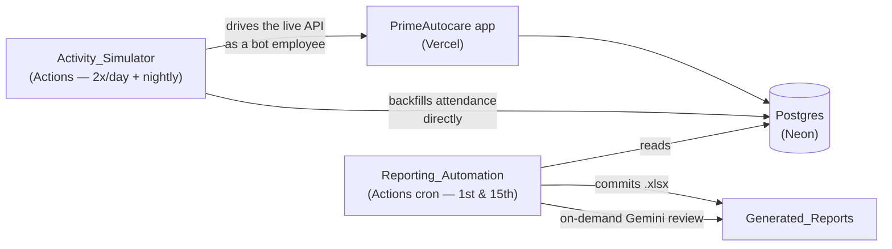

  

  # Service Management and Automated Reporting Ecosystem, Running on Simulated Activity.

**PrimeAutocare** is a vehicle service management and invoicing platform that
runs itself — a portfolio project built by a two-person team where automated
simulation generates realistic day-to-day activity and worklogs, and a
zero-touch reporting pipeline turns that activity into business reports, with
no human in the loop.

---

## 🏗️ Architecture

```mermaid
flowchart LR
    A["PrimeAutocare app<br/>(Vercel)"] --> DB[("Postgres<br/>(Neon)")]
    E["Activity_Simulator<br/>(Actions — 2x/day + nightly)"] -- "drives the live API<br/>as a bot employee" --> A
    E -- "backfills attendance<br/>directly" --> DB
    R["Reporting_Automation<br/>(Actions cron — 1st &amp; 15th)"] -- reads --> DB
    R -- "commits .xlsx" --> G["Generated_Reports"]
    R -- "on-demand Gemini review" --> G
```

## 📦 Repositories

| Repository | What it is |
| --- | --- |
| [PrimeAutocare](https://github.com/PrimeAutocare/PrimeAutocare) | The application — FastAPI + SQLAlchemy backend, React 19 + Vite + Tailwind frontend, Postgres schema |
| [Activity_Simulator](https://github.com/PrimeAutocare/Activity_Simulator) | Bot that simulates day-to-day shop activity — drives the live API for jobs, invoices, and payments, and backfills realistic attendance straight into Postgres |
| [Reporting_Automation](https://github.com/PrimeAutocare/Reporting_Automation) | Scheduled Groovy scripts building six Excel reports — payroll, utilization, receivables, revenue, WIP, and attendance — from the live database, plus an on-demand Gemini cross-report review |
| [Generated_Reports](https://github.com/PrimeAutocare/Generated_Reports) | Published reports — the current workbook per report, with every past period archived |

Start with the [PrimeAutocare README](https://github.com/PrimeAutocare/PrimeAutocare#readme)
for the full picture, including local setup.

## 🛠️ Tech Stack

- **Frontend** — React 19, Vite, Tailwind CSS, React Router
- **Backend** — FastAPI, SQLAlchemy, Python
- **Database** — PostgreSQL (Neon)
- **Reporting** — Apache Groovy, Apache POI, Gemini API
- **Automation** — GitHub Actions, cron-driven, zero human involvement
- **Deployment** — Vercel

## 🎨 Brand Palette

| Token | Hex | Usage |
| --- | --- | --- |
| Prime Gold | `#D97706` | Buttons, active nav, logo accent |
| Gold Hover | `#F59E0B` | Hover states, focus rings |
| Charcoal | `#18181B` | App background |
| Slate | `#27272A` | Cards, sidebar |
| Ash | `#3F3F46` | Borders, inputs |

---

## 👥 Team

<table>
  <tr>
    <td align="center">
      <a href="https://github.com/InukaWijerathna">
         
        <b>Inuka Wijerathna</b>
      </a>
    </td>
    <td align="center">
      <a href="https://github.com/SenukaWijerathna">
         
        <b>Senuka Wijerathna</b>
      </a>
    </td>
  </tr>
</table>
